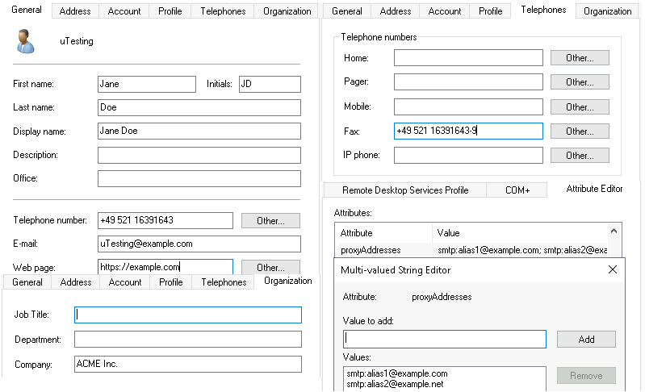
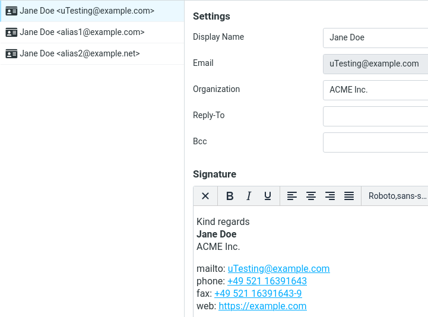

# Roundcube Plugin: `identity_from_directory` (use LDAP or AD to maintain email identities)

A [Roundcube](https://roundcube.net/) [plugin](https://plugins.roundcube.net/) to populate and maintain a user's email identities automatically on each login, based on corresponding LDAP or Active Directory data.


## Table of Contents

* [Screenshots](#screenshots)
* [Installation](#installation)
  * [Installation using Composer](#installation-using-composer)
  * [Installation from release tarball](#installation-from-release-tarball)
* [Updating](#updating)
  * [Update using Composer](#update-using-composer)
  * [Update from release tarball](#update-from-release-tarball)
* [Configuration](#configuration)
* [Compatibility](#compatibility)
* [Licensing, copyright](#licensing-copyright)
* [Author information](#author-information)


## Screenshots

A user with the following Active Directory data



and a signature template set to

```php
$config['identity_from_directory_signature_template_html'] = '
<p>
    Kind regards<br />
    <strong>%name_html%</strong><br />
    %organization_html%
</p>
<p>
    mailto: <a href="mailto:%email_url%">%email_html%</a><br />
    phone: <a href="tel:%phone_url%">%phone_html%</a><br />
    fax: <a href="tel:%fax_url%">%fax_html%</a><br />
    web: <a href="%website_url%">%website_html%</a>
</p>';
```

would result in the following Roundcube identities after the user login:




## Installation

### Installation using Composer

The following command installs the [plugin package](https://packagist.org/packages/foundata/identity_from_directory) via [Composer](https://getcomposer.org/download/) into `plugins/identity_from_directory`:

```bash
php composer.phar require --update-no-dev -o "foundata/identity_from_directory:*"
```

If you want to use the current development version from Git, use `-o "foundata/identity_from_directory:dev-main"`. Please confirm with `y` when Composer asks you whether you want to enable the plugin in the Roundcube configuration. Alternatively, add `identity_from_directory` to Roundcube's `$config['plugins']` array by hand.

You can now [configure](#configuration) the plugin.


### Installation from release tarball

Download the latest [`identity_from_directory-vX.Y.Z.tar.gz` tarball](https://github.com/foundata/roundcube-plugin-identity-from-directory/releases) (do not use the "Source code" archives Github creates automatically for each release). Extract it into `plugins/`, all files have to be in `plugins/identity_from_directory/` afterwards.

Useful snippet if you have got a shell available on your target server:

```bash
# set Rouncube's installation path, adapt if needed
roundcube_install_dir="/var/lib/roundcube"

# get version number of the latest release
version="$(curl -s -L https://api.github.com/repos/foundata/roundcube-plugin-identity-from-directory/releases/latest | jq -r '.tag_name' | sed -e 's/^v//g')"
printf '%s\n' "${version}"

# download
curl -L "https://github.com/foundata/roundcube-plugin-identity-from-directory/releases/download/v${version}/identity_from_directory-v${version}.tar.gz" \
  > "/tmp/identity_from_directory.tar.gz"

# extract and cleanup
cd "${roundcube_install_dir}/plugins" && tar -xzvf "/tmp/identity_from_directory.tar.gz" && rm "/tmp/identity_from_directory.tar.gz"
```

[Configure](#configuration) the plugin and add `identity_from_directory` to Roundcube's `$config['plugins']` array to enable it.


## Updating

### Update using Composer

The following command updates the [plugin package](https://packagist.org/packages/foundata/identity_from_directory) via [Composer](https://getcomposer.org/download/):

```bash
php composer.phar update --no-dev -o "foundata/identity_from_directory:*"`
```

### Update from release tarball

Updating is as simple as overwriting the existing files. Just follow the [installation instructions](#installation) again to get the newest release. This should be a low-risk operation as there were no backwards-compatibility-breaking releases yet and there are no database schema changes.


## Configuration

- Copy the template [`config.inc.php.dist`](./config.inc.php.dist) to `config.inc.php` (Composer may already have done this for you)
- Now edit `plugins/identity_from_directory/config.inc.php` as you need. The [inline comments](./config.inc.php.dist) describe every config value in detail.

Some additional notes:

* All **plugin actions are only triggered during a user's login**. So logout and login again to test a new configuration.
* This plugin is technically **compatible with all values of Roundcube's `$config['identities_level']`** config option. However, a value of `1` (user can edit all params but not the email address as well as add or delete identities in the UI) or `3` (user can edit all params but not the email address and cannot add or delete identities in the UI) makes most sense.
* Set `$config['identity_from_directory_deleteunmanaged'] = true` if you want to **delete propably unwanted identities automatically**.
* Set `$config['identity_from_directory_handle_proxyaddresses'] = true` to **support searching for alias addresses in Active Directory's `proxyAddresses` field**. It may contain a CSV string like `smtp:foo@exmaple.com,smtp:bar@example.net`.


## Compatibility

- Roundcube 1.6 or higher.
- PHP 7.4 or higher.
- No special database requirements. This plugin does not adapt the database schema and is using Roundcube's built-in actions and hooks to handle the identity data.

The plugin may work with older versions then listed above, but this is not tested nor supported. We recommend using the latest stable Roundcube version and PHP 8.x, which the plugin is most tested with.


## Licensing, copyright

<!--REUSE-IgnoreStart-->
Copyright (c) 2024, foundata GmbH (https://foundata.com)

This project is licensed under the GNU General Public License v3.0 or later (SPDX-License-Identifier: `GPL-3.0-or-later`), see [`LICENSES/GPL-3.0-or-later.txt`](LICENSES/GPL-3.0-or-later.txt) for the full text.

The [`.reuse/dep5`](.reuse/dep5) file provides detailed licensing and copyright information in a human- and machine-readable format. This includes parts that may be subject to different licensing or usage terms, such as third party components. The repository conforms to the [REUSE specification](https://reuse.software/spec/), you can use [`reuse spdx`](https://reuse.readthedocs.io/en/latest/readme.html#cli) to create a [SPDX software bill of materials (SBOM)](https://en.wikipedia.org/wiki/Software_Package_Data_Exchange).
<!--REUSE-IgnoreEnd-->

[](https://api.reuse.software/info/github.com/foundata/roundcube-plugin-identity-from-directory)


## Author information

This project was created and is maintained by [foundata](https://foundata.com/). If you like it, you might [buy them a coffee](https://buy-me-a.coffee/roundcube-plugin-identity-from-directory/). The plugin was heavily inspired by the [`new_user_identity` plugin](https://github.com/roundcube/roundcubemail/tree/master/plugins/new_user_identity).
